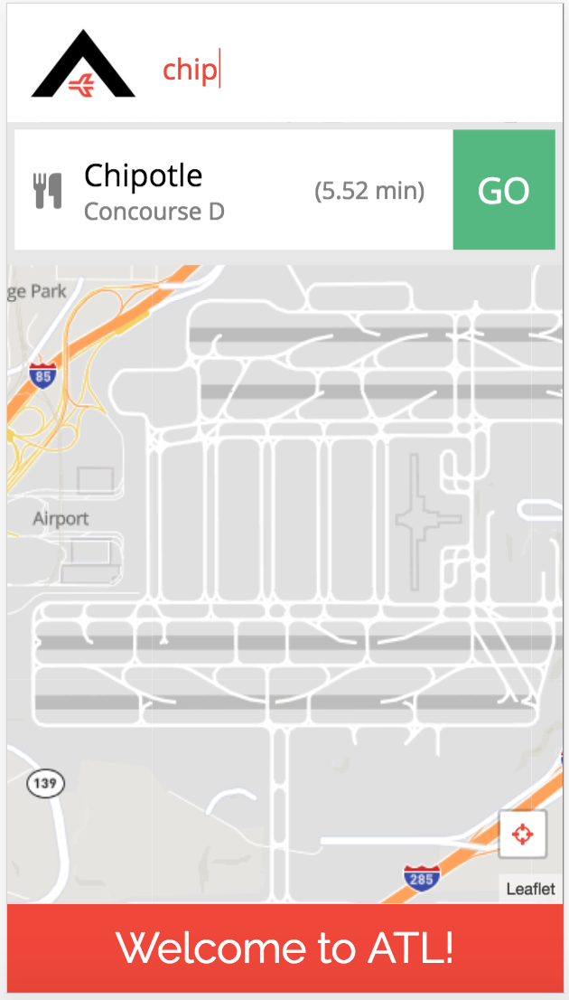
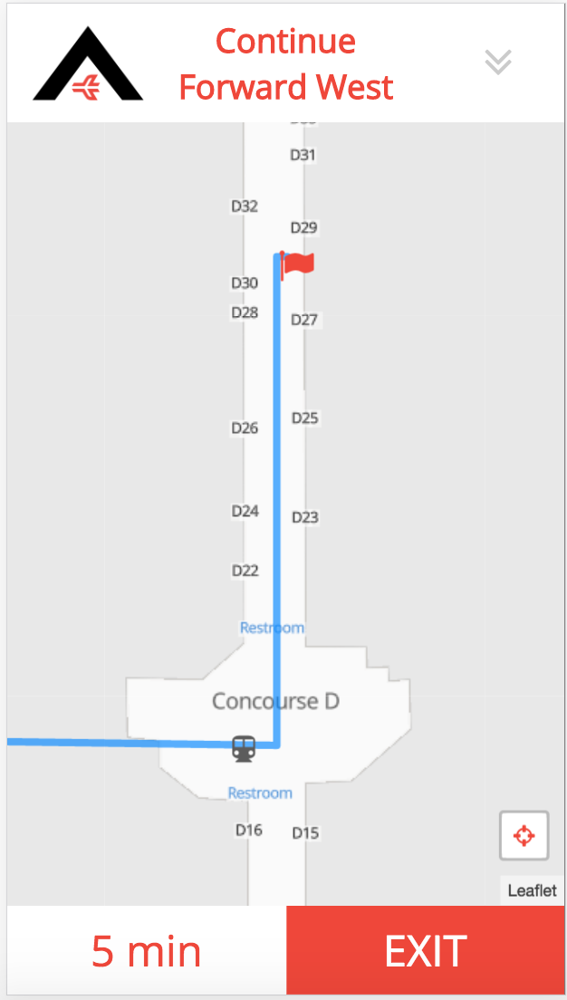

# The "A" Team - AirNav

######
[Live Project](http://http://52.40.91.213/#/home)   |  [Overview](https://github.com/DigitalCrafts-September-2016-Cohort/the_a_team2#overview)   |   [Team](https://github.com/DigitalCrafts-September-2016-Cohort/the_a_team2#team-members--roles)   |   [What We Used](https://github.com/DigitalCrafts-September-2016-Cohort/the_a_team2#what-we-used)   |   [MVP](https://github.com/DigitalCrafts-September-2016-Cohort/the_a_team2#mvp-minimum-viable-product)   |   [Challenges](https://github.com/DigitalCrafts-September-2016-Cohort/the_a_team2#challenges--solutions)   |   [Code](https://github.com/DigitalCrafts-September-2016-Cohort/the_a_team2#code-snippets)   | [Screenshots](https://github.com/DigitalCrafts-September-2016-Cohort/the_a_team2#airnav-screenshots)   |
[Airport Terminal Maps](https://github.com/DigitalCrafts-September-2016-Cohort/the_a_team2#airport-terminal-maps)   |   [Contributing](https://github.com/DigitalCrafts-September-2016-Cohort/the_a_team2#contribute-to-airnav)

## Overview:
Atlanta Airport Navigation (AirNav) is a web application designed to help Atlanta
Airport travelers navigate the world's busiest airport. Hartsfield-Jackson Atlanta
International Airport, known locally as Atlanta Airport, is located 7 miles south
of the central business district of Atlanta. The Atlanta Airport has 5 runways,
7 concourses and 209 domestic and international gates, so AirNav was built to
help the millions of travelers that come through the Atlanta Airport to easily
navigate their way from terminal to terminal, find restaurants or shopping along
the way, as well as locate their baggage and ground transportation.

**Concept:**
* Turn-by-turn directions, each step updated in map view as well as full list view
* Use automated geolocation to get user location and origins
* List of all points of interest along route to gate destination
* Deploy as a web app AND a mobile app for both iPhone and Android using the Ionic framework

##Github Link:
[AirNav](https://github.com/DigitalCrafts-September-2016-Cohort/the_a_team2.git)

##Team Members & Roles:
**Click on each member's name to see their GitHub profile**
All team members are students in the [Digital Crafts](https://digitalcrafts.com) September 2016 cohort. This project was initially completed as the second project for that curriculum and utilized the SCRUM agile development methodology.  Paired and mob programming were the focus in the initial and final stages, while mid- and late-stage work was primarily completed through individual but coordinated and co-located programming.

####The A Team
* [Jesslyn Landgren](https://github.com/jesslynlandgren/)  
**Primary team role:** Front-end Gladiator/Back-end backup, styling 
**Contributions:**  Provided initial project concept. Built a custom, responsive layout from scratch with focus on clean, robust design. Helped Keyur build out initial front-end and back-end, then assisted with troubleshooting throughout project. Led team in continuously evaluating user-interface and user-experience of site, including semantics and critique of supported functionalities. Led the charge on all things visual/client-facing. Organized site navigation. 
**Key code portions:** Most of the HTML, CSS and JavaScript.

* [Keyur Patel](https://github.com/ekeyur/)  
**Primary team role:** Back-end Soldier 
**Contributions:** Built a custom, responsive layout from scratch with focus on clean, robust design. Implemented functionality via the back end, utilizing Djikstra's algorith, returning data from the JSON file for use in front end functionality.  
**Key code portions:** Most of the Python code (server.py) and data (points.JSON).

* [Jason Campbell](https://github.com/mtnzorro/)  
**Primary team role:** Ionic Trooper, AngularJS, Front End functionality, Front end styling, Deployment 
**Contributions:** Developed the Ionic version of the app in conjuction with the main site build.  Additionally, helped to build the functionality of front end of the web app, utilizing AngularJS, along with initial decisions of the front end structure.  Handled deployment of the web app to AWS.  
**Key code portions:** All of the Ionic build.  Front end AngularJs contributions to the main JS file.

* [Trista McCleary](https://github.com/mccleary/)  
**Primary team role:** UI/UX chief, prototype, styling 
**Contributions:** Scrum master. Led daily stand up meetings and maintained virtual scrum board. App name, app logo. Assisted with all things visual/client-facing. Regularly studied all code throughout project. 
**Key code portions:** UI/UX mock-ups, shell HTML, README file

##What we used:
**Languages:**
* Python
* JavaScript
* HTML5
* CSS

**Frameworks:**
* AngularJS
* Flask
* Ionic

**API's**
* Mapbox
  * Custom Map Style built from Mapbox-Streets-v7
* Leaflet (Leaflet Angular Directive)
  * [Leaflet Locate Control Plugin](https://github.com/domoritz/leaflet-locatecontrol)

**Other:**  
* Font Awesome
* Sketch
* InVision
* [Open Street Map](http://www.openstreetmap.org/)
* [simpleWeather.js](http://simpleweatherjs.com/)

##MVP (Minimum Viable Product):

* Point-to-point navigation
* Search for destination
* As-You-Type search suggestions for all points of interest
* Returned route is shortest path
* Display gate-to-gate route on a map
* Turn-by-turn directions, list view
* Update and display the remaining time until reaching the destination
* Auto-detect user location and follow along with the navigation route
* Points of Interest along the route (restaurants, shopping, coffee, restrooms)

We planned our stretch goals in advance of reaching MVP and portions of the team began work on them about 2 days before the project deadline.

**Stretch Goals**
* Search box with drop-down for sub-categories(food, shop, baggage)
* Style map points
* App functionality in Ionic
* Field testing of geolocation features

## Challenges & Solutions:
**Some of the biggest challenges we faced with this project build included:**

1.  **Challenge:**

    **Solution:**   

2.  **Challenge:** Ionic Implementation

    **Solution:**  Knowing that the webapp would only make sense in mobile form, we wanted to make a strong push to build a native option for Iphone/Android, and Ionic was a logical choice, being that it utilizes Angular for development.  Jason spent the weekend before the project researching and learning Ionic, and the team determined early on that pushing for the Ionic build would be worth the added time and effort.  Through trial and error, and help of a Digital Crafts alum, we were able to build an Ionic version of the webapp alonside the main build.

3.  **Challenge:** Understanding Dijkstra's algorithm such that we were able to effectively implement it into the back end for purposes of calculating the shortest route between the origin and given destination.  

    **Solution:** Thorough study of the algorithm, through materials (articles, videos) and group meetings walking through concepts including the heap sort, the alogrithm itself, along with sample code examples of others who'd succesfully implemented the algorithm.  Coupled with a couple of hours worth of white boarding, and meticulous walk throughs, we were able to successfully implement the algorithm programatically.

4. **Challenge:**
       **Solution:**  

##Code Snippets

<!-- Insert code here -->

## AirNav Screenshots:

<!-- 

 -->

## Airport Terminal Maps:
Please click on a Concourse to view Hartsfield-Jackson Atlanta Airport Terminal maps:
* [Concourse A](https://github.com/DigitalCrafts-September-2016-Cohort/the_a_team2/blob/master/static/img/Concourse-A.pdf)
* [Concourse B](https://github.com/DigitalCrafts-September-2016-Cohort/the_a_team2/blob/master/static/img/Concourse-B.pdf)
* [Concourse C](https://github.com/DigitalCrafts-September-2016-Cohort/the_a_team2/blob/master/static/img/Concourse-C.pdf)
* [Concourse D](https://github.com/DigitalCrafts-September-2016-Cohort/the_a_team2/blob/master/static/img/Concourse-D.pdf)
* [Concourse E](https://github.com/DigitalCrafts-September-2016-Cohort/the_a_team2/blob/master/static/img/Concourse-E.pdf)
* [Concourse F](https://github.com/DigitalCrafts-September-2016-Cohort/the_a_team2/blob/master/static/img/Concourse-F.pdf)
* [Concourse T](https://github.com/DigitalCrafts-September-2016-Cohort/the_a_team2/blob/master/static/img/Concourse-T.pdf)
* [Domestic Terminal](https://github.com/DigitalCrafts-September-2016-Cohort/the_a_team2/blob/master/static/img/DomesticTerminal.pdf)

********

#Contribute to AirNav:

## 3 Desired Contributions We would like to see :
1. App reviews from users traveling through Atlanta Airport (Bugs, issues, suggestions, praise)
2. En route restaurant suggestions for user, sorted by user selected options (healthy, allergy sensitive, etc)
3. Restaurant reviews, Yelp style

##Contributing
1. Fork it
2. Create a new feature branch (named after your intended feature): `git checkout -b new-feature-name`
3. Commit your changes: `git commit -am 'Added the feature!'`
4. Push to your feature branch: `git push origin new-feature-name`
5. Submit a pull request!

##Project History
12/2/2016 - Project Completion and Deployment  
11/28/2016 - Project Start  
